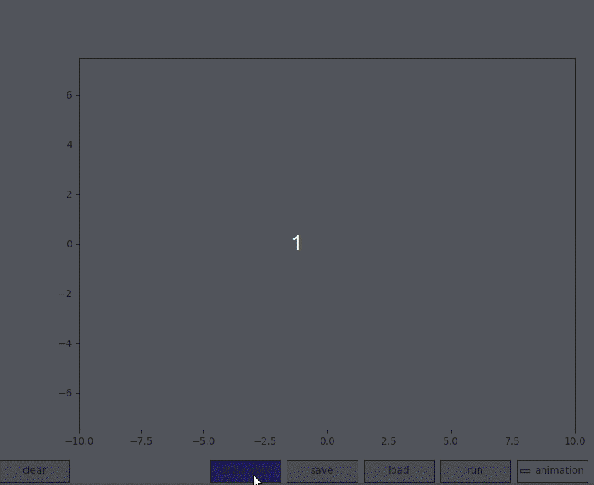

# Teb DEMO

A tool designed for individuals interested in learning TEB(http://wiki.ros.org/teb_local_planner). The basic algorithm is inherited from TEB, but the optimization algorithm utilizes GTSAM. Additionally, it provides a user-friendly Python GUI that allows for easy drawing of various obstacle-based environments to test the algorithm.

## Usage:
Install gtsam.  
https://gtsam.org/get_started/

```bash
mkdir build
cd build
cmake ..
make 
cd srcipt
python3 demo_gui.py
```

## Demo


